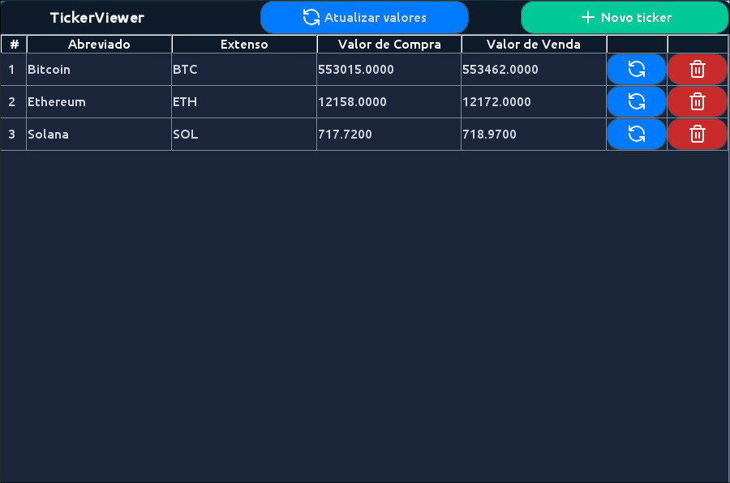

# Projeto de CCH de Programação Orientada a Objetos - TickerViewer

## Professor: Evandro Miguel Kuszera

### Alunos: Felipe B. Ribeiro, Felipe F. Adames, Matheus O. H. Ris, Luiz H. M. Machado.

---

- O projeto utiliza a versão 24 do Java (Não garanto que o programa funcione em outras versões)
- Use o maven para compilar o projeto com o comando ```mvn clean package```
- Rode o projeto com ```java --enable-preview -jar target/cch-cripto-jar-with-dependencies.jar``` ou utilize o IntelliJ para rodar a Main.java

## Screenshot do projeto:


